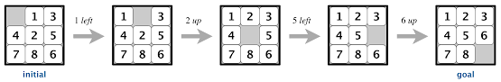
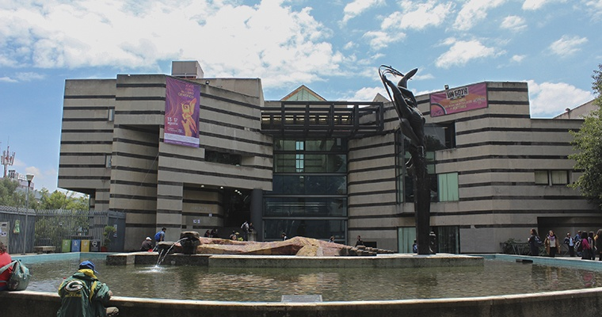

# Tarea de Inteligencia Artificial


<b>Por: Yonathan Berith Jaramillo Ramirez </b>,
<b>Por: Yonathan Berith Jaramillo Ramirez </b>,
<b>Por: Yonathan Berith Jaramillo Ramirez </b>,
<b>Por: Yonathan Berith Jaramillo Ramirez </b>,
<b>Por: Yonathan Berith Jaramillo Ramirez </b>,  Mexico, CDMX.<br />
Lenguaje de programacion: Python 3.10.6<br />
Descripcion: Implementacion Depth-First Search para resolver el 8 puzzle game.
# Depth-First Saearch algoritmo para resolver 8 PUZZLE 


## 1. 8 Puzzle game



El juego de 8-puzzle es un tablero de 3x3 piezas deslizables donde cada cuadro tiene un numero, asi todos estan numerados hasta llegar a el 8, los cuadros se encuentran en un orden random con un cuadro faltante, por ende uno debe ir deslizando hasta encontrar el orden correcto

## 2. Breadth-First Search

Es un algoritmo para hacer busquedas en estructuras de datos como un arbol o bien un grafo, comienza en la rama raiz (o bien en algun nodo arbitrario si es el caso de un grafo) y explora tan lejos como es posible en cada rama antes de hacer backtracking.

Para mas informacion visitar los siguientes links

Link: wikipedia ->  https://en.wikipedia.org/wiki/Depth-first_search
Link: wikipedia -> https://en.wikipedia.org/wiki/Backtracking
## 3. Datos de entrada del programa

Execute python via comand prompt:
```sh
python main.py 'Estado del tablero inicial'
```
 El estado del tablero inicial  es con lo que se va a inicar a correr el algoritmo para encontrar el mejor camino<br/>

Ejemplo dfs:
```sh
python main.py 1,e,2,6,3,4,7,5,8
```

## 4. Resultados 

Se imprimiran en la terminal las acciones realizadas por el agente para resolver el problema
```sh
\ai\AI-8PuzzleAlgorithm>python main.py 1,e,2,6,3,4,7,5,8
path:  ['Left', 'Up', 'Up', 'Left', 'Down', 'Right', 'Down', 'Left', 'Up', 'Right', 'Right', 'Up', 'Left', 'Left', 'Down', 'Right', 'Right', 'Up', 'Left', 'Down', 'Down', 'Right', 'Up', 'Left', 'Up', 'Left']
cost:  26
nodes expanded:  166786
search_depth:  26
MaxSearchDeep:  27
running_time: 3.97613275
```

